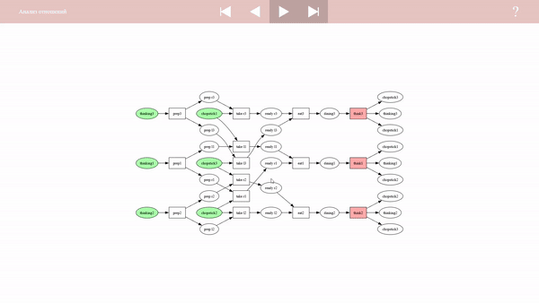
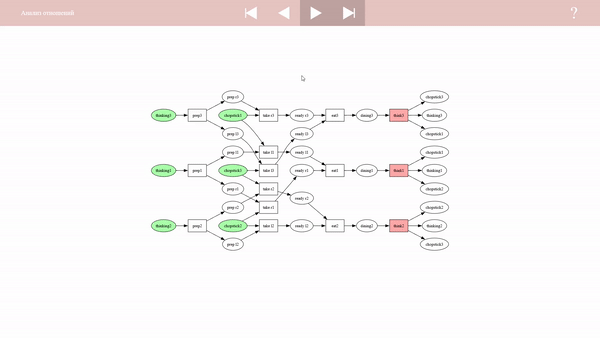
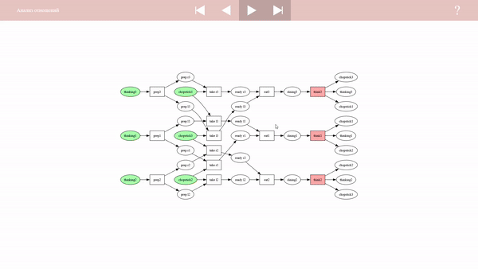
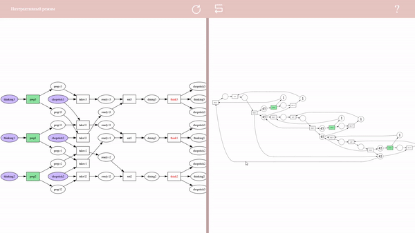
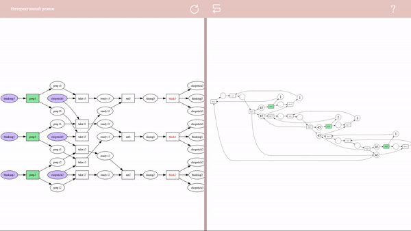

# unfolding-viz
## Установка
> pip install unfolding-viz
## Описание
Библиотека, основанная на [pm4py-pn-unfoldings](https://github.com/TimurTimergalin/Unfoldings), для создания 
интерактивных визуализаций разверток сетей Петри
## Пример использования
Чтобы создать визуализацию, используется функция `visualize`. Пример её использования можно найти в *example.py*.
## Возможности
### Осмотр развертки
Использую мышь или клавиатуру можно перемещать и масштабировать развертку

### Перемотка алгоритма построения развертки
Можно изучить, как работает конкретный алгоритм построения развертки, запустив его пошагово

### Анализ отношений между элементами развертки
Можно узнать отношения между любым элементом и всеми остальными: следование, конфликт, конкуренцию

### Проигрывание переходов
Можно изучить различные конфигурации срабатываний в сети и то, как они отображаются на развертке, в интерактивном режиме

### Поиск дедлоков
Можно быстро и удобно искать дедлоки
